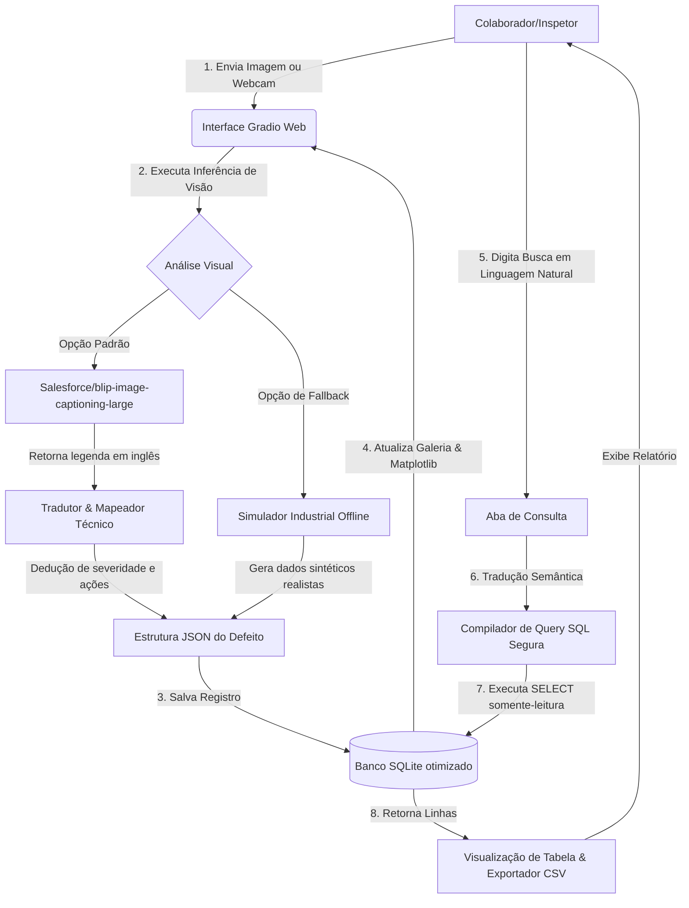

# 🛠️ DefectVision Industrial Assistant

O **DefectVision Industrial Assistant** é uma plataforma inteligente e moderna voltada para a manutenção preditiva e controle de qualidade industrial. Ele une o poder de **Visão Computacional Multimodal (Hugging Face BLIP-large)** para a detecção de defeitos de manufatura com uma **Interface de Linguagem Natural (Text-to-SQL)** para consulta do histórico de inspeções, tudo em uma interface web rica, responsiva e elegante de cores claras.

---

## 📊 Arquitetura e Fluxo do Sistema

O assistente foi desenhado para atuar de forma ponta a ponta na esteira de inspeção de peças industriais. O fluxo geral compreende a captura de dados, o diagnóstico inteligente por IA, a persistência otimizada e a busca semântica de registros históricos:



---

## ✨ Principais Funcionalidades

### 1. 📸 Inspeção Visual Automatizada (Multimodal)
*   **Upload ou Câmera**: Envie fotos de componentes industriais diretamente da galeria ou capture via webcam em tempo real.
*   **Análise Multimodal**: O modelo local de Deep Learning **Salesforce/blip-image-captioning-large** (carregado sob demanda na CPU) gera legendas descritivas.
*   **Tradução e Mapeamento Técnico**: A aplicação traduz e extrai informações essenciais para registrar o defeito:
    *   **Severidade Mapeada**: Classifica o nível de risco (`BAIXO`, `MÉDIO`, `ALTO`, `CRÍTICO`).
    *   **Causa Raiz**: Sugere prováveis motivos de fadiga física/química.
    *   **Ação Recomendada**: Prescreve ações de contingência para os técnicos.
    *   **Localização Espacial**: Identifica a região do defeito no quadrante da imagem.
*   **Banner de Alertas Críticos**: Exibição imediata de um banner vermelho pulsante e chamativo para anomalias com severidade `CRÍTICO`, instruindo parada de máquina urgente.

### 2. 💬 Consulta de Histórico Inteligente (Text-to-SQL Seguro)
*   Busque informações passadas escrevendo perguntas naturais como:
    *   *"defeitos críticos do mês passado"*
    *   *"todos os registros de ferrugem"*
    *   *"quantas inspeções esta semana"*
    *   *"peças com severidade alta em junho"*
*   **Compilador Seguro**: O backend traduz a consulta em SQL dinâmico e aplica uma camada de proteção robusta (bloqueia comandos de alteração de tabelas como `DROP`, `DELETE`, `INSERT`, `ALTER`, executando a query em modo `sqlite3` de somente leitura).
*   **Exportação**: Tabela interativa com resultados e opção para baixar os dados em formato CSV para integração industrial.

### 3. 📊 Indicadores Gerais & Galeria Visual (Dashboard)
*   **Painel Gráfico**: Visualização com gráficos gerados dinamicamente via `matplotlib` (Ocorrências por Tipo de Defeito e Defeitos por Severidade), adaptado com uma paleta de cores moderna e de alto contraste.
*   **Galeria Interativa**: Cards modernos e dinâmicos para cada inspeção realizada, contendo a miniatura da imagem (gerada rapidamente via Base64 inline), badges coloridos e abas de expansão (`<details>`) para ver o relatório completo.

---

## 🛠️ Tecnologias Utilizadas

*   **Interface Web**: [Gradio](https://gradio.app/) (CSS customizado com tema claro premium baseado em Slate & Blue).
*   **Visão Computacional**: [Hugging Face Transformers](https://huggingface.co/) e [PyTorch](https://pytorch.org/) (Carregamento lazy e execução do BLIP-large).
*   **Armazenamento**: [SQLite](https://www.sqlite.org/) (Garantia de persistência rápida e queries indexadas de alta performance).
*   **Data Science**: [Pandas](https://pandas.pydata.org/) para manipulação de tabelas e [Matplotlib](https://matplotlib.org/) para a plotagem estática de dashboards.

---

## 📂 Estrutura do Projeto

```text
├── uploads/              # Armazenamento das fotos de inspeção registradas
├── temp/                 # Diretório de arquivos temporários e CSVs de exportação
├── app.py                # Ponto de entrada do Gradio, CSS e estrutura visual
├── analysis.py           # Análise de visão computacional, tradutor de linguagem natural e gráficos
├── db.py                 # Inicialização de banco de dados SQLite, índices e queries seguras
├── defeitos.db           # Banco de dados SQLite persistente
└── requirements.txt      # Dependências necessárias para execução
```

---

## 🚀 Instalação e Execução

### Pré-requisitos
*   Python 3.10 ou superior instalado.
*   Conexão com internet na primeira inicialização para baixar o modelo BLIP-large da Hugging Face (~750 MB).

### Passos para Rodar

1.  **Clonar o Repositório**:
    ```bash
    git clone https://github.com/seu-usuario/defectvision-assistant.git
    cd defectvision-assistant
    ```

2.  **Configurar o Ambiente Virtual com Conda**:
    ```bash
    # Criar o ambiente virtual com Python 3.10
    conda create --name defectvision python=3.10 -y
    
    # Ativar o ambiente virtual
    conda activate defectvision
    ```

3.  **Instalar Dependências**:
    Com o ambiente virtual ativado, instale as dependências executando:
    ```bash
    pip install -r requirements.txt
    ```

4.  **Iniciar a Aplicação**:
    ```bash
    python app.py
    ```

5.  **Acessar no Navegador**:
    Após a inicialização do terminal, abra o seguinte endereço:
    ```text
    http://127.0.0.1:7861
    ```

---

## 🛡️ Segurança de Dados
Para evitar injeções de SQL perigosas, a camada de banco de dados (`db.py`):
1.  Higieniza a query limando comentários multi-linha (`/* ... */`) e de linha única (`--`).
2.  Garante que a instrução inicie exclusivamente com o comando `SELECT`.
3.  Utiliza uma lista negra regex para palavras-chave modificadoras como `INSERT`, `UPDATE`, `DELETE`, `DROP` e `ALTER`.
4.  Conecta-se ao arquivo SQLite no modo **URI de Somente Leitura** (`mode=ro`), garantindo que falhas de parsing não possam comprometer a integridade dos dados industriais.
